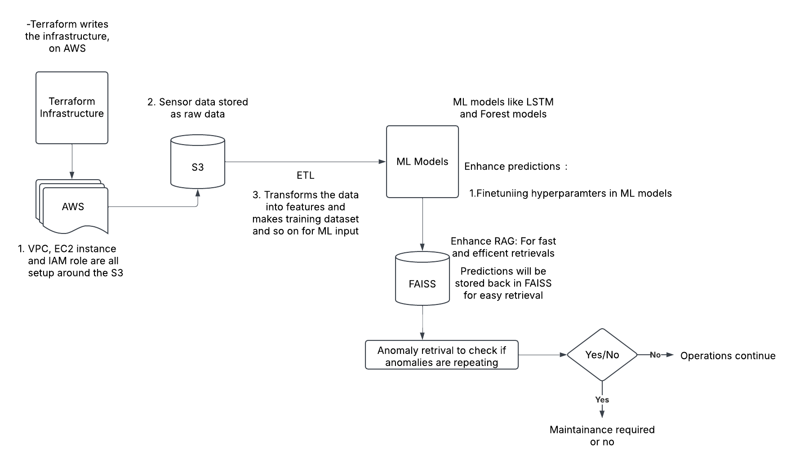

# Energy Grid Anomaly Detection

## Overview

The **Energy Grid Anomaly Detection** project focuses on detecting anomalies in energy grid sensor data using machine learning techniques. The project integrates a cloud-based infrastructure powered by AWS, managed through Terraform, to store sensor data, process it, and train machine learning models for anomaly detection. The goal is to build a pipeline that can identify potential issues (such as voltage spikes or irregular current readings) and improve the overall reliability of the energy grid.



## Features

- **Cloud Infrastructure Setup:** Uses Terraform to provision and manage the AWS infrastructure, including VPC, EC2, S3, IAM roles, and more.
- **Data Pipeline:** Loads raw energy grid sensor data into an S3 bucket, followed by feature engineering and processing using Python.
- **ML Models:** Implements machine learning models (Isolation Forest and LSTM) to detect anomalies in energy grid data.
- **Embeddings with FAISS:** Stores the model predictions as embeddings for efficient anomaly comparison and retrieval.
- **Retrieval Augmented Generation (RAG) Pipeline:** Uses FAISS for retrieval of embeddings and compares user inputs against stored embeddings to identify anomalies.

## Project Components

This project uses several tools and frameworks:

- **AWS**: Cloud infrastructure for storing data, running EC2 instances for model training, and managing security.
- **Terraform**: Infrastructure as code tool used to set up and maintain AWS resources like VPC, S3, and IAM roles.
- **Python**: Main programming language for data processing, feature engineering, and model training.
- **Streamlit**: A UI tool for creating interactive interfaces, allowing users to test the anomaly detection models.
- **TensorFlow/PyTorch**: Libraries for training deep learning models, including LSTM for time-series anomaly detection.
- **FAISS**: A library to efficiently search and retrieve the closest vectors (embeddings), used for anomaly detection.

---

## Setup and Configuration

### 1. **Cloud Infrastructure Setup with Terraform**

Terraform is used to create and manage AWS infrastructure. The following AWS resources are provisioned:

- **VPC (Virtual Private Cloud):** A virtual network to host your AWS resources.
- **Subnets:** Divide the VPC into different subnets for better security and network isolation.
- **Internet Gateway:** Enables communication between the VPC and the internet.
- **S3 Bucket:** Used to store raw sensor data (CSV files).
- **IAM Roles:** Configure the necessary roles and permissions for interacting with AWS services like S3 and Bedrock.

**Steps to apply Terraform configurations:**

1. Install Terraform if you haven't already: https://www.terraform.io/downloads.html
2. Initialize Terraform in your project directory:
   ```bash
   terraform init
   ```
3. Apply the Terraform configuration to provision AWS resources:
   ```bash
   terraform apply
   ```

This will create the necessary AWS infrastructure, including the VPC, EC2 instances, S3 bucket, and IAM roles for accessing Bedrock and S3.

---

### 2. **Loading Data to S3**

The first step in the pipeline is to upload raw energy grid sensor data to an S3 bucket. This data will be stored in CSV format, containing attributes such as time, voltage, and current.

**Steps to load data into S3:**

1. Install the AWS CLI and configure it with your AWS credentials:
   ```bash
   aws configure
   ```
2. Use the following command to upload your CSV file to the S3 bucket created by Terraform:
   ```bash
   aws s3 cp /path/to/your/sensor_data.csv s3://your-bucket-name/
   ```

---

### 3. **Data Pipeline and Feature Engineering**

Once the data is uploaded to S3, a pipeline is created to process the data and extract features necessary for training machine learning models.

**Feature Engineering Steps:**

1. **Extracting Data**: Use Python and the `boto3` library to load the raw data from the S3 bucket.

   ```python
   import boto3
   import pandas as pd

   s3 = boto3.client('s3')
   obj = s3.get_object(Bucket='your-bucket-name', Key='sensor_data.csv')
   df = pd.read_csv(obj['Body'])
   ```

2. **Transforming Data**: The raw data is then processed and transformed into features that can be fed into machine learning models. Features include statistical measures, trends (e.g., voltage spikes), and any other relevant data.

   ```python
   df['voltage_trend'] = df['voltage'].rolling(window=10).mean()  # Example feature
   ```

3. **Loading Data into Training Set**: After the transformation, the data is ready to be used in the training pipeline, where it will be fed into machine learning models like Isolation Forest and LSTM.

---

### 4. **ML Model Training**

The project uses two machine learning models for anomaly detection:

- **Isolation Forest** (unsupervised)
- **LSTM** (time-series supervised)

**Training the Models:**

1. Install the necessary libraries for training:

   ```bash
   pip install scikit-learn tensorflow
   ```

2. Train the Isolation Forest model:

   ```python
   from sklearn.ensemble import IsolationForest

   model = IsolationForest(n_estimators=100, contamination=0.1)
   model.fit(df[['voltage_trend']])
   ```

3. Train the LSTM model for time-series anomaly detection:

   ```python
   from tensorflow.keras.models import Sequential
   from tensorflow.keras.layers import LSTM, Dense

   model = Sequential()
   model.add(LSTM(50, activation='relu', input_shape=(timesteps, features)))
   model.add(Dense(1))
   model.compile(optimizer='adam', loss='mse')
   model.fit(X_train, y_train, epochs=10)
   ```

4. Evaluate the models on the test set, and choose the model with the best performance (e.g., using metrics like F1-score).

---

### 5. **Storing Predictions as Embeddings in FAISS**

After training, the predictions from the models are stored as embeddings in FAISS for efficient retrieval.

**Steps for storing predictions in FAISS:**

1. Install FAISS:

   ```bash
   pip install faiss-cpu
   ```

2. Convert model predictions into embeddings and store them in FAISS:

   ```python
   import faiss

   embeddings = model.predict(df[['voltage_trend']])
   index = faiss.IndexFlatL2(embeddings.shape[1])
   index.add(embeddings)
   ```

---

### 6. **Retrieving Embeddings and Comparing User Inputs**

To identify anomalies, user inputs are compared against the stored embeddings. FAISS is used for efficient nearest neighbor search.

**Steps to retrieve embeddings and compare with user input:**

1. Accept user input via Streamlit UI:

   ```python
   import streamlit as st

   voltage_input = st.number_input("Enter Voltage Value")
   ```

2. Search for the nearest embeddings using FAISS:

   ```python
   D, I = index.search(voltage_input, k=1)
   ```

3. Compare the retrieved embeddings with the input to determine if it's close to an anomaly:
   ```python
   if D[0] < threshold:
       st.write("Anomaly Detected!")
   else:
       st.write("No Anomaly")
   ```

---

## Running the Project

1. **Set Up AWS Infrastructure**: Apply the Terraform configuration to set up your AWS resources.
2. **Upload Data to S3**: Upload your sensor data to the S3 bucket.
3. **Run the Python Pipeline**: Execute the feature engineering, model training, and embedding storage.
4. **Use Streamlit for User Interaction**: Run the Streamlit UI to test anomaly detection with user inputs.

---

## Time Estimate

This project can take approximately **6-8 days** to complete, depending on the complexity of the data, model training time, and the fine-tuning process.

---

## License

This project is licensed under the MIT License - see the [LICENSE](LICENSE) file for details.
